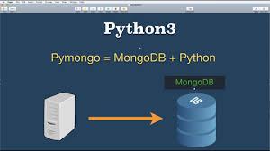

 
Pymongo has become one of the easiest ways to store data from python-flask web apps.

I'm sure nobody would want to stress up doing hard stuff if there are other easier means to do them.

I discovered pymongo when i was developing a small website for a project in school, and after discovering how simple it is, i've been using it for my small projects.
After going through this tutorial, I'm hoping you will feel the same.

##Prerequisites
So to begin with, make sure you have the PyMongo distribution installed. In the python shell, run the following:

``` python
>>> import pymongo
```
I'm hoping that MongoDB instance is running on the default host and port. So if MongoDb is installed, you can start it:
``` python
$ mongod
```
##Set up connection with Mongoclient
After the prerequisites, the next step is to create a MongoClient to the running  mongod instance.
```python 
>>> from pymongo import MongoClient
>>>client = MongoClient()
```
You can specify the host and port as follows:
```python
>>> client = MongoClient('localhost', 5000)
#alternatively
>>> client = MongoClient('mongodb://localhost:5000/')
```

Now that we are done with the necessary connections, lets get into the more interesting part:
##Creating a database
With PyMongo you access databases using attribute style access on MongoClient instances, as follows:
```python
>>> db = client.database1
#or if that does not work use the following
>>> db = client['database1']
```
##Creating a collection
A collection is a group of documents that are stored in MongoDB, its the equivalent of a table in relational databases. To create the collection:
```python
>>> collection = db.collection1
#using dictionary-style access
>>> collection = db['collecion1']
```

##Documents
We represent data in MongoDB using JSON-style documents. In PyMongo we use dictionaries to represent documents. For example:
```python
>>> post = {"author": "George",
...         "text": "My first tutorial",
...         "tags": ["mongodb", "python", "pymongo"]}

```
##Inserting a Document
To insert a document into a collection we can use the insert_one() method:
```python
>>> posts = db.posts
>>> post_id = posts.insert_one(post).inserted_id
>>> post_id
ObjectId('...')
```


 
 Thanks for going through my tutorial, I hope it will help you create better databases.
 For more information, you can visit <a href="http://api.mongodb.com/python/current/tutorial.html">MONGODB</a>
 Bye!